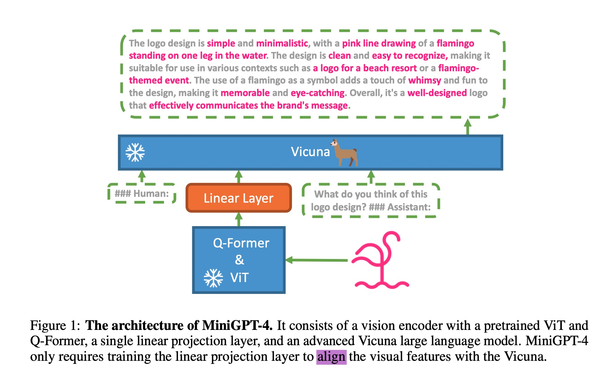

# Mini vs. Tiny
In this document we compare the MiniGPT-4 vs. TinyGPT-V models.

Mini = MiniGPT-4, Tiny = TinyGPT-V

- "TinyGPT-V: Efficient Multimodal Large Language Model via Small Backbones"
  - https://github.com/DLYuanGod/TinyGPT-V 
  - https://arxiv.org/abs/2312.16862
  - China/Singapore/USA
  - 2/10/23
  - Local link: [TinyGPT.pdf](../pdfs/TinyGPT.pdf)
- "MiniGPT-4: Enhancing Vision-Language Understanding with Advanced Large Language Models"
  - https://github.com/Vision-CAIR/MiniGPT-4
  - https://minigpt-4.github.io/
  - https://arxiv.org/abs/2304.10592
  - KAUST (Saudia Arabia)
  - 28/12/23
  - Local link: [MiniGPT-4.pdf](../pdfs/MiniGPT-4.pdf)

## Mini
Build upon Vicuna ([link](https://lmsys.org/blog/2023-03-30-vicuna/); [local]() 
Vicuna-13B) which is trained by fine-tuning LLaMA () on the data "ShareGPT". 
In figure 1 we can see the architecture which is quite simple: 

ViT + Q-Former => Liner Layer => Vicuna

The linear layer is the only tuned layer!

